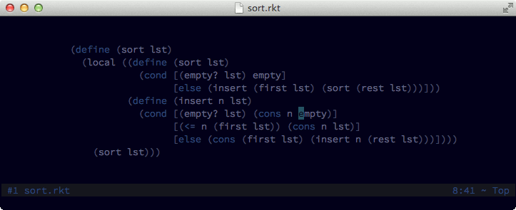

## wildfire.vim

With *Wildfire* you can quickly select the closest text object among a group of candidates. By default candidates are `i'`, `i"`, `i)`, `i]`, `i}`, `ip` and `it`.

Learn more about text objects with `:help text-objects`.


### Installation

Install either with [Pathogen](https://github.com/tpope/vim-pathogen), [Vundle](https://github.com/gmarik/Vundle.vim), [NeoBundle](https://github.com/Shougo/neobundle.vim), or your favorite plugin manager.

### Usage

Press `<ENTER>` in normal mode to select the closest text object. Keep pressing `<ENTER>` for selecting the **next** closest text object. To go the other way round, that is, to select the **previously** selected text object, press `<BS>`.

To speed things up, if you want to select the `n`th closest text object you can press a number followed by `<ENTER>` (e.g. pressing `2<ENTER>` will select the second closest text object).

You can change default mappings with:

```vim
" This selects the next closest text object.
map <SPACE> <Plug>(wildfire-fuel)

" This selects the previous closest text object.
vmap <C-SPACE> <Plug>(wildfire-water)
```

By default, *Wildfire* selects any of the text objects `i'`, `i"`, `i)`, `i]`, `i}`, `ip` and `it`. You can decide the ones to consider with the following option:

```vim
let g:wildfire_objects = ["i'", 'i"', "i)", "i]", "i}", "ip", "it"]
```

### Advanced usage

Sometimes considering certain kinds of text objects can be quite annoying. This is the case of Html, where, for example, you may want to select just tag objects.

Wildfire allows you to be selective about which text objects are considered with different filetypes:

```vim
" use '*' to mean 'all other filetypes'
" in this example, html and xml share the same text objects
let g:wildfire_objects = {
    \ "*" : ["i'", 'i"', "i)", "i]", "i}"],
    \ "html,xml" : ["at", "it"],
\ }
```

One problem with the solution above is that with `html` and `xml` files we loose the ability to select the text objects `i'`, `i"`, `i)`, `i]` and `i}`. To solve this problem, Wildfire allows you to use different mappings for different text object candidates:

```vim
vmap <BS> <Plug>(wildfire-water)

map <SPACE> <Plug>(wildfire-fuel)
let g:wildfire_objects = {
    \ "*" : ["i'", 'i"', "i)", "i]", "i}"]
\ }

" As you can see, to add additional mappings we have to follow a simple convention
map <ENTER> <Plug>(wildfire-fuel:tags)
let g:wildfire_objects_tags = {
    \ "html,xml" : ["at", "it"],
\ }
```

### Quick selection (experimental)

```vim
nmap <leader>s <Plug>(wildfire-quick-select)
```


